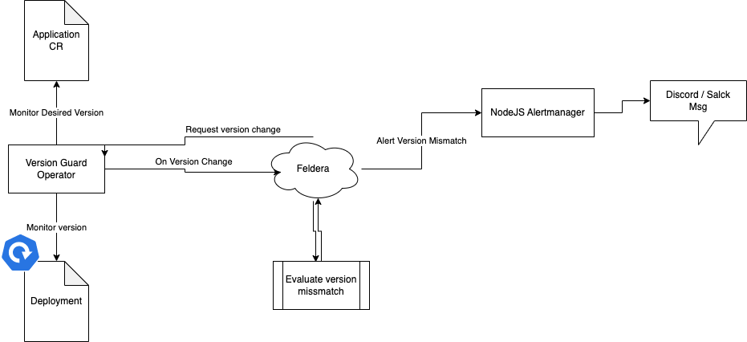

# Version Guard Operator



## Description
This kubernetes operator is responsible for monitoring the versions of the applications running in the cluster.
You can define your apps with the desiered version and the operator will notify you if the version changes. 
The changes will go to Feldera and get evaluated there. After it's complet the result will go back to the operator
to make the desired changes or just a simple node.js application that will send a notification to a slack/discord channel via webhook.

## Tools
- [Operator SDK]()
- [Kubebuilder]()
- [Kustomize]()
- [Golang]()
- [Kubernetes]()
- [Feldera]()
- [Node.js]()

## Installation

## Data Models
### CRs
#### Application
```yaml
apiVersion: version-guard.tmit.bme.hu/v1alpha1
kind: Application
metadata:
  name: nginx-app
  namespace: web-app
  labels:
    app: test # Going to look for deployments by this label(s)
spec:
  name: nginx
  image: nginx:1.14.3
```

Example deployment to monitor:

```yaml
apiVersion: apps/v1
kind: Deployment
metadata:
  name: nginx-deployment
  labels:
    app: nginx # Matched by this label
spec:
  replicas: 3
  selector:
    matchLabels:
      app: nginx 
  template:
    metadata:
      labels:
        app: nginx
    spec:
      containers:
      - name: nginx
        image: nginx:1.14.2
        ports:
        - containerPort: 80
```

### Operator (Application CR "event") -> Feldera (Application Input)
According to the example above if the image of the Application changes  
```json
{
  "type": "Application",
  "name": "nginx-app",
  "namespace": "web-app",
  "container_name": "nginx",
  "image": "nginx:1.14.3",
  "timestamp": "2019-10-10T10:10:10Z" 
}
```

### Operator (Deployment change "event") -> Feldera (Deployment Input)
According to the example above if the image of the Deployment changes
```json
{
  "kind": "Deployment",
  "name": "nginx-deployment",
  "namespace": "web-app",
  "container_name": "nginx",
  "image": "nginx:1.14.2",
  "timestamp": "2019-10-10T10:10:10Z" 
}
```

### Feldera (version mismatch Output) -> Operator / Alertmanager
According to the input examples above
```json
{
    "kind": "Deployment",
    "name": "nginx-app",
    "namespace": "web-app",
    "container_name": "nginx",
    "current_image": "nginx:1.14.3",
    "desired_image": "nginx:1.14.2",
    "timestamp": "2019-10-10T10:10:10Z" 
}
```
